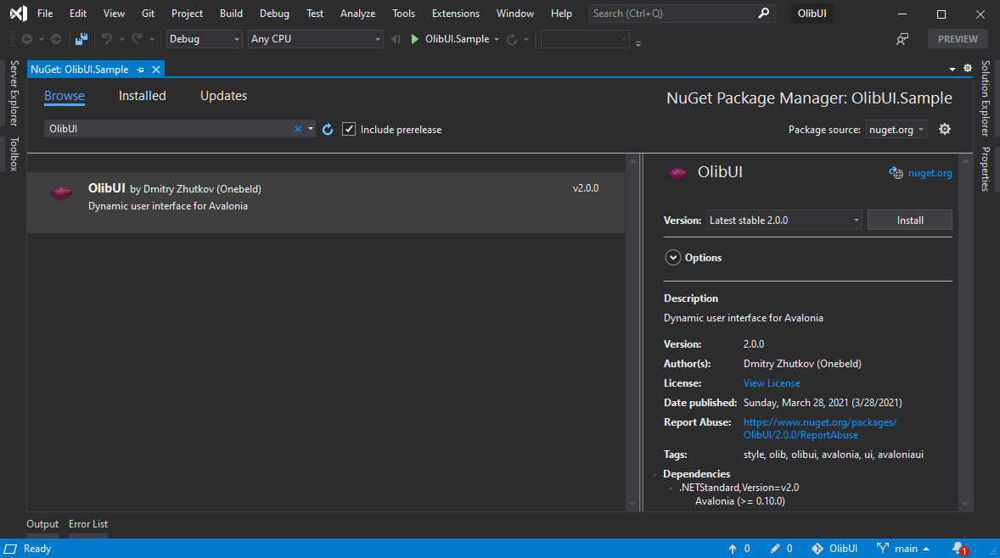
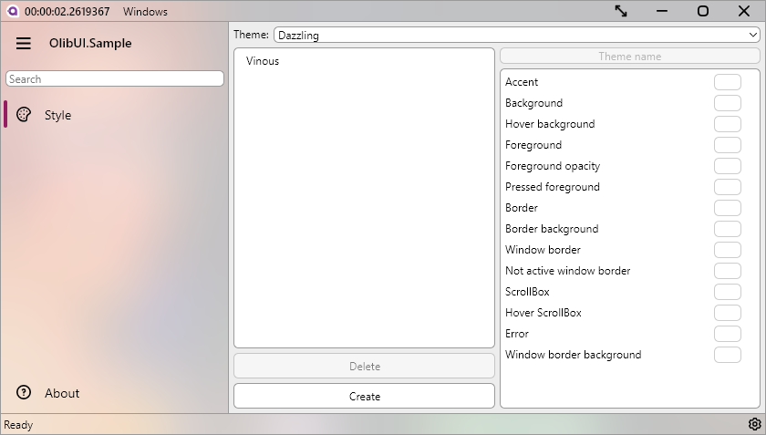
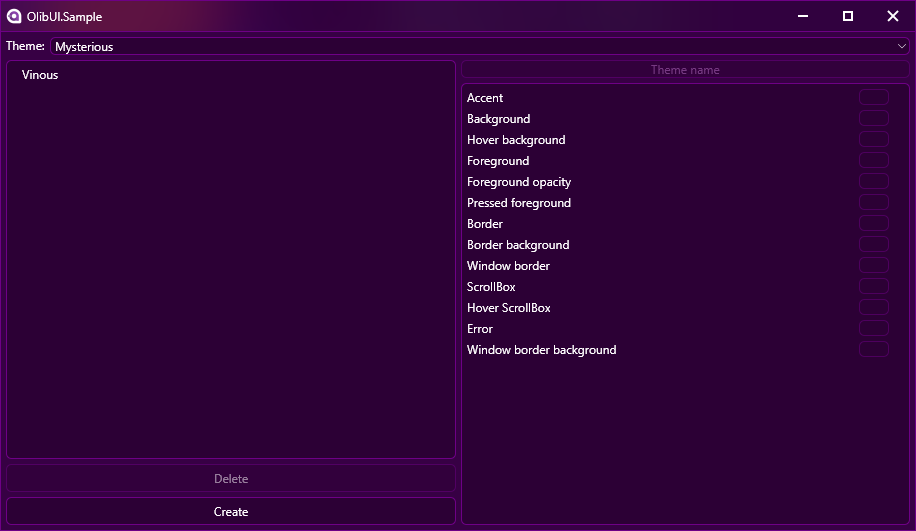
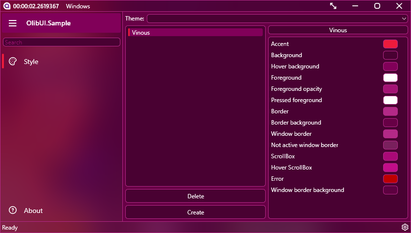
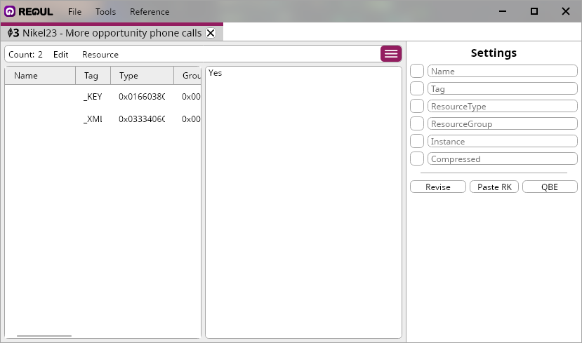

<h1 align="center">
  
  OlibUI
</h1>

OlibUI - dynamic user interface for AvaloniaUI. The main advantages of this library are: runtime skinning and localization. At the moment, some controls are not supported, but you can already use it.

## Installation
Installation via command line:
```cmd
dotnet add package OlibUI --version 2.0.0
```

Installation using a package manager:
```cmd
Install-Package OlibUI -Version 2.0.0
```

Inserting into .csproj PackageReference:
```xml
<PackageReference Include="OlibUI" Version="2.0.0" />
```

Installation with Visual Studio:



## Preparation
The library can work without a default theme. Therefore, we just connect OlibUI. You also need to connect the theme. In this case, we connect "Dazzling", there are only 5 of them.
```xml
<Application xmlns="https://github.com/avaloniaui"
             xmlns:x="http://schemas.microsoft.com/winfx/2006/xaml"
             x:Class="YourApp.App">
  <Application.Styles>
    <StyleInclude Source="avares://OlibUI/OlibUI.xaml"/>
    <StyleInclude Source="avares://OlibUI/Themes/Dazzling.axaml"/>
  </Application.Styles> 
</Application>
```

OlibUI supports dynamic localization. If you will not be translating your application into other languages, add this line to App.axaml:
```xml
<StyleInclude Source="avares://OlibUI/Local/Lang.en.axaml"/>
```

After connecting, you can change the window to the one that comes with OlibUI:
```xml
<olib:OlibWindow xmlns="https://github.com/avaloniaui"
                 xmlns:x="http://schemas.microsoft.com/winfx/2006/xaml"
                 xmlns:d="http://schemas.microsoft.com/expression/blend/2008"
                 xmlns:olib="using:OlibUI.Windows"
                 x:Class="YourApp.MainWindow"
                 WindowStartupLocation="CenterScreen"
                 TransparencyLevelHint="AcrylicBlur"
                 WindowButtons="All">
</olib:OlibWindow>
```
```cs
using Avalonia.Markup.Xaml;
using OlibUI.Windows;

namespace YourApp
{
    public class MainWindow : OlibWindow
    {
        public MainWindow()
        {
            InitializeComponent();
        }

        private void InitializeComponent()
        {
            AvaloniaXamlLoader.Load(this);
        }
    }
}

```

## Screenshots

These are examples of what your application might look like.







[Regul](https://github.com/Onebeld/Regul)



## Credits
* [AvaloniaUI](https://github.com/AvaloniaUI/Avalonia)
* [ColorPicker](https://github.com/wieslawsoltes/ThemeEditor) by wieslawsoltes


