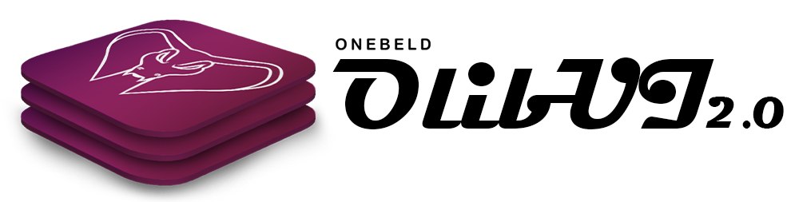
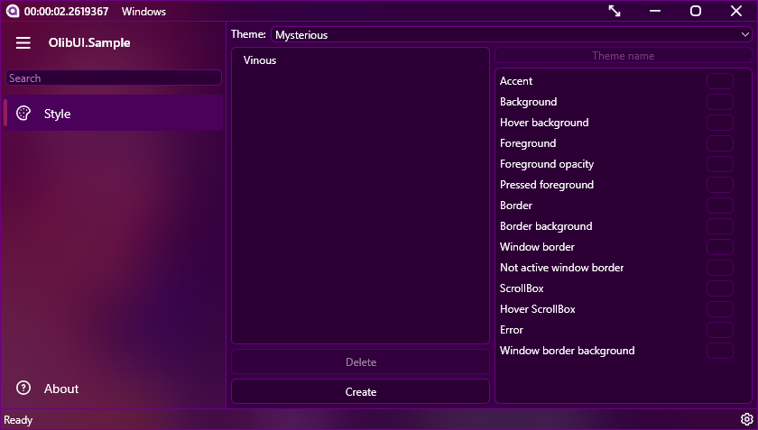

# This project is very outdated. Consider using [PleasantUI](https://github.com/Onebeld/PleasantUI).

<h1 align="center">
  
  OlibUI
</h1>

OlibUI - dynamic user interface for AvaloniaUI. The main advantages of this library are: runtime skinning and localization. At the moment, some controls are not supported, but you can already use it.

Over the years I have been improving my design. This library was part of several of my programs. With the release of OlibUI 2.0, you can install and create applications with this design. The design was first used on OlibKey, a password manager. After stopping the development of this program, I wanted to keep the name, design and logo. Why not OlibUI 1.0? First of all, rethinking my concept to design and delivering it as a separate library.

## Installation
Installation via command line:
```cmd
dotnet add package OlibUI --version 2.2.0
```

Installation using a package manager:
```cmd
Install-Package OlibUI -Version 2.2.0
```

Inserting into .csproj PackageReference:
```xml
<PackageReference Include="OlibUI" Version="2.2.0" />
```

Installation with Visual Studio:


## Preparation
The library can work without a default theme. Therefore, we just connect OlibUI. You also need to connect the theme. In this case, we connect "Dazzling", there are only 5 of them.
```xml
<Application xmlns="https://github.com/avaloniaui"
             xmlns:x="http://schemas.microsoft.com/winfx/2006/xaml"
             x:Class="YourApp.App">
  <Application.Styles>
    <StyleInclude Source="avares://OlibUI/OlibUI.xaml"/>
    <StyleInclude Source="avares://OlibUI/Themes/Dazzling.axaml"/>
  </Application.Styles> 
</Application>
```

OlibUI supports dynamic localization. If you will not be translating your application into other languages, add this line to App.axaml:
```xml
<StyleInclude Source="avares://OlibUI/Assets/Local/Lang.en.axaml"/>
```

After connecting, you can change the window to the one that comes with OlibUI:
```xml
<OlibWindow xmlns="https://github.com/avaloniaui"
                 xmlns:x="http://schemas.microsoft.com/winfx/2006/xaml"
                 xmlns:d="http://schemas.microsoft.com/expression/blend/2008"
                 x:Class="YourApp.MainWindow"
                 WindowStartupLocation="CenterScreen"
                 TransparencyLevelHint="AcrylicBlur"
                 WindowButtons="All">
</OlibWindow>
```
```cs
using Avalonia.Markup.Xaml;
using OlibUI.Windows;

namespace YourApp
{
    public class MainWindow : OlibWindow
    {
        public MainWindow()
        {
            InitializeComponent();
        }

        private void InitializeComponent()
        {
            AvaloniaXamlLoader.Load(this);
        }
    }
}

```

## Screenshots

These are examples of what your application might look like.





[Regul](https://github.com/Onebeld/Regul)


## Credits
* [AvaloniaUI](https://github.com/AvaloniaUI/Avalonia)
* [ColorPicker](https://github.com/wieslawsoltes/ThemeEditor) by wieslawsoltes
* [NavigationView](https://github.com/PieroCastillo/Aura.UI) by PieroCastillo


